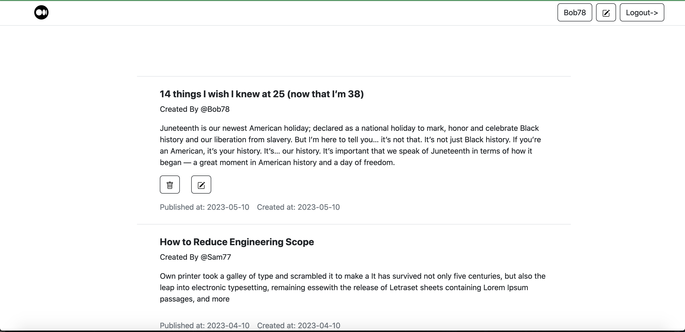
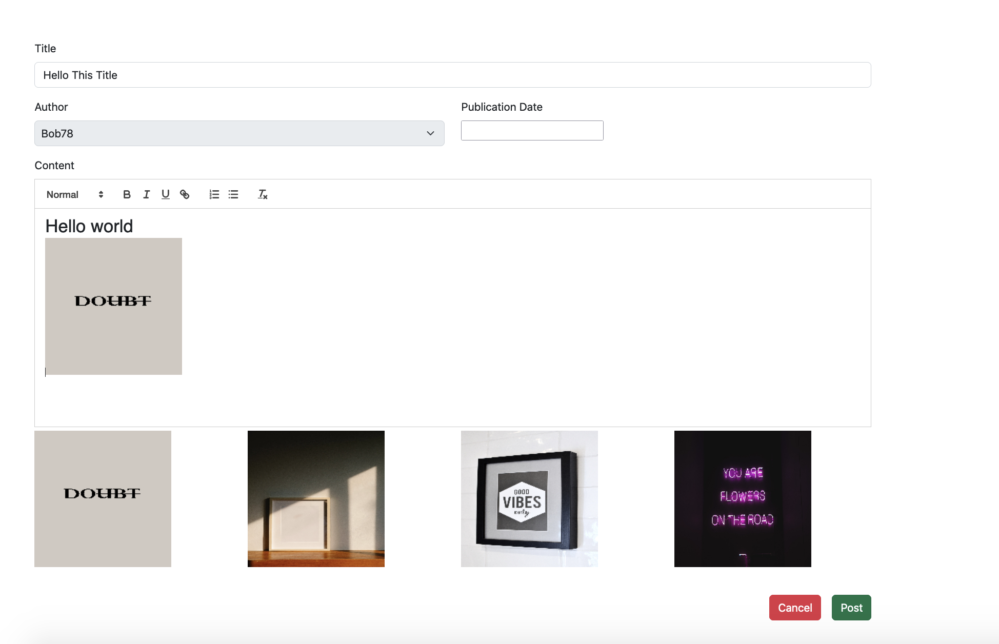

# Exam #1: "CMSmall"

## Student: s297978 GUL EREN 

# Server side

## API Server

- POST `/login`
  - There are no request parameters and the request body contains the user session credentials in json format.
  - If the authentication completed correctly, returns 201 as a status code. If authentication incompleted for some reason(incorrect credentials), returns 401 with error message
  
- GET `/api/sessions/current`
  - There are no request parameters and the request body contains the user session credentials in json format.
  - If the user still authenticated system(no session expiration), returns the user. If any problems occures returns 401 status code with error message

- GET `/website`
  - There are no request parameters and the no request body contains. Designed for website information
  - It response website informations(website name) with status code 200, if any problems occurs returns 500 with error message

- DELETE `/api/sessions/current`
  - There are no request parameters and the request body contains the user session credentials in json format.
  - It developed for logout operation. It returns 200 status code without body

- GET `/pages`
  - There are no request parameters and the no request body contains. 
  - It returns all page. If no error occurs, returns 200 status code with list of pages. If any error occures, returns 500 and error message

- GET `/page/:id`
  - There is a request parameters that is the id which represents the page id. There is no request body
  - It responses related page by given id with status code 200, if any problems occurs returns 500 with error message

- PUT `/updateWebSiteName`
  - There are no request parameters. Request body contains the name field which is for the new website name to update. 
  - Returns true with 204 status code. If any error occurs, returns 500 with error message

- POST `/createPage`
  - There are no request parameters. Request body contains the created page information such as title, content, publication date,creation date, username, status.
  - Returns created page with related field and 201 status code. If any error occurs, returns 500 with error message.

- PUT `/editPage/:id`
  - There is request parameters that is the id which represents the edited page id. There is also page body, which contains the updated page fields.
  - Returns true with 204 status code. If any error occurs, returns 500 with error message

- DELETE `/deletePage/:id`
  -  It developed for delete page. There is request parameters that is the id which represents the edited page id. There no request body
  - It returns 200 status code with true. If any error occurs, returns 500 with error message

- GET `/getUserPages`
  - It designed for the back-office management. There are no request parameters and the no request body contains. 
  - It returns 200 status and list of user pages. If any error occurs, it returns 500 status code with error message

- GET `/user`
  - It designed for the fetch all users. There are no request parameters and the no request body contains. 
  - It returns 200 status and list of users. If any error occurs, it returns 500 status code with error message
- ...

## Database Tables

- Table `user` 
  - authorID INTEGER 
  - email VARCHAR (10)
  - password VARCHAR (150)
  - salt VARCHAR (150)
  - username VARCHAR (150)
  - role VARCHAR (150)

- Table `page` 
  - id INTEGER 
  - username VARCHAR (15)
  - creationDate DATE 
  - publicationDate DATE
  - status VARCHAR (15)
  - content TEXT
  - title TEXT

- Table `website`
  - name VARCHAR (15)

# Client side

## React Client Application Routes

- Route `/`: It routes to Main Content component. It consists of all published pages
  which allowed for authenticated and non-authenticated users.
- Route `/editor`: It routes to Editor component which usefull for create and edit the pages. This endpoints only allow to authenticated users.
- Route `/user`: It routes to User component which is provides the the back-off management for the user. User can see all own pages (event draft and scheduled). Website name can be edited, in case user is an admin.
- Route `/login`: It routes to Login component which is provides the Login the systems.
- Route `/*`: It routes the NotFound component, if any unrelated url entered which are not a part of websites

## Main React Components
-View level component: It's a component user can see directly in page and may compose by anouther pure level components

-Pure level component: This component used by many view level components such as navbar, alert..

- `LoginForm` (in `views/Login.jsx`): It is view level component which provides the user to login into website
- `MainLayout` (in `MainLayout.jsx`): It composed by permanent <Navbar /> on the top and <Outlet /> which is provides the nested components structure. 
- `NotFound` (in `NotFound.jsx`): Any unrelated urls are consider a not found (404) error. This components handle this case and provides the option the return main page by clicking the button
- `Notification` (in `Alert.jsx`): This components provides the notifation mechanism to project if user should be inform. Component uses the Bootstrap Alerts and once any thing happens in the website, it inform the user by set the setNotication state in user context.
- `MyEditor` (in `Editor.jsx`): This components provides the, edit, create page to the user. User able to change page and submit by using ReactQuill editor.
- `MainContent` (in `MainContet.jsx`): This components renders the list of pages for non-authenticated user by using Page component.
- `MyNavbar` (in `Navbar.jsx`): This components renders the navbar for the website. It consist logo, website and buttons for create a page Login, Logout.
- `Page` (in `Page.jsx`): This components render the page with related fields, such as publicationDate, content, title.
- `User` (in `UserContent.jsx`): This designed for the back-office operation and renders the list of pages for authenticated user by using Page component.

# Usage info

## Example Screenshot

## Users Credentials
- username, password (information)
- Bob78, s297978 - just a user and has one published and one drafted page
- Sam77, s297977 - just a user and has published, drafted, scheduled pages
- Allen76, s297976 - just a user and has no page
- Kyle75, s297975 - is an admin

